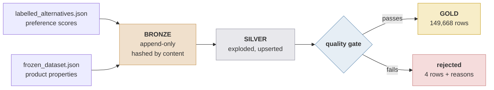

# concrete-lakehouse-pipeline

Incremental bronze/silver/gold pipeline on Delta Lake and Databricks, turning
two nested JSON files into one validated table for modelling.

Source: a published research dataset of concrete product recommendations
([DOI 10.34810/DATA3164](https://doi.org/10.34810/DATA3164)) — 42,874 decision
scenarios with 149,670 candidate mixes, split across two files that have to be
joined to be useful.



## Tables

| Table | Grain | Rows |
|---|---|---|
| `bronze_ingest_log` | file version, by content hash | 2 |
| `bronze_labels` / `bronze_features` | scenario, still nested | 42,874 each |
| `silver_labels` | scenario + label ordinal | 149,672 |
| `silver_features` | scenario + alternative ordinal | 149,670 |
| `silver_scenario_stakeholder` | scenario + stakeholder ordinal | 45,146 |
| `silver_scenario_situation` | scenario + situation ordinal | 43,755 |
| **`gold_scenarios`** | **label + its product's features** | **149,668** |
| `gold_scenarios_rejected` | rejected row + reasons | 4 |

## Incremental processing

Each run hashes every raw file against `bronze_ingest_log`, appends only unseen
content, upserts silver for the affected scenarios, then uses silver's Change
Data Feed to recompute exactly the gold rows that moved. A run with nothing new
writes nothing — ingest drops from 130s to 42s.

Three design points:

**Content hashing, not filenames.** Two arrival patterns must work: a new file
beside the old one, and a file replaced under the same name by a re-release.
Auto Loader handles the first but tracks paths and ignores modifications, so it
cannot see the second. SHA-256 per file covers both and runs in open-source
Spark, keeping the incremental path testable locally.

**The merge deletes.** If a re-release drops a scenario from 6 labels to 3, an
insert/update-only merge leaves 3 stale rows and no row count reveals it. Hence
`WHEN NOT MATCHED BY SOURCE THEN DELETE`, scoped per table from that table's own
source — a shared scope would delete rows a batch never mentioned.

**Ordinals, not product ids.** `(scenario_id, id_prod)` is not unique: scenarios
`2647` and `13122` label `prod_1` twice. `MERGE` on a non-unique key fails, so
`posexplode` gives every silver row a stable identity.

Whole-scenario deletion is not handled incrementally — the scope comes from
scenarios present in the new file. Use `--full-refresh`.

## Quality gate

Failing rows go to `gold_scenarios_rejected` with reasons attached. Promoted +
rejected always equals the joined total.

| Check | Failures on real data |
|---|---|
| `pref`, `conf` in [0,1] | 0 |
| No duplicate `(scenario, product)` | **4** |
| Both files agree on a scenario's products | 0 |
| Every label has features, and vice versa | 0 |
| `compressive_strength` 5–150 MPa | 0 |
| `water_to_cement_ratio` 0.20–1.00 | 0 |
| `density` 1200–3000 kg/m³ | 0 |

Those 4 are a real defect in the published data: scenarios `2647` and `13122`
each label `prod_1` twice with contradictory scores (0.62 at conf 0.75 against
0.05 at conf 0.95). Both copies are rejected; the source gives no basis for
picking a winner.

The run **fails** when rejections exceed 1% (real data: 0.003%) or any row has
`source_type = unknown`. `gold_scenarios` also carries Delta `CHECK` constraints
on `pref`, `conf`, `source_type` and join completeness.

## Provenance (`source_type`)

| ID shape | `source_type` | Scenarios |
|---|---|---|
| `control_health_1068` | `control_synthetic` — 8 probe axes | 24,000 |
| `3782` | `llm_generated` | 18,602 |
| `expert_118` | `expert_annotated` | 272 |

Two traps found by profiling (`scripts/explore_raw.py`): `expert_1..272` and the
plain IDs `1..272` both count from 1 but are unrelated scenarios sharing no
products; `control_archfinish` and `control_archfinish_slump` are separate
probes, not one with a suffix.

## Validation

A direction check, not a model: a mis-keyed join yields the right number of
wrong rows, which no row count detects. Each `control_*` family varies one
variable, so each should dominate its own and sit near zero elsewhere.

```
control_axis              rows          gwp       health    circ_orig
gwp                     10,459      -0.9994      +0.0067      +0.0165
health                  10,504      -0.6695      +0.9152      +0.6293
archfinish              10,512      -0.0043      -0.0017      -0.6038
archfinish_slump        10,665      +0.0163      -0.0145      +0.0055
cost                    10,312      +0.0067      -0.0047      -0.0153
density                 10,440      +0.0165      +0.0009      -0.0148
fwu                     10,501      -0.0207      +0.0099      +0.0077
wdp                     10,447      +0.0058      +0.0033      +0.0075
```

`archfinish` is negative on `circ_orig` by construction: more recycled content,
worse surface finish.

## Delta time travel

`scripts/delta_versioning_demo.py` writes gold with a deliberately buggy
classifier, corrects it, and diffs the versions:

```
11,553 rows reclassified, 0 added, 0 removed

before               -> after                      rows   scenarios
llm_generated        -> control_synthetic        10,665       3,000
llm_generated        -> expert_annotated            888         272
```

Exactly the `archfinish_slump` and expert families. The old version stays
queryable: `SELECT * FROM workspace.concrete.gold_scenarios VERSION AS OF 0`.

## Running on Databricks

Databricks Free Edition, serverless (DBR 19.6, Photon). One-time setup:

1. **Catalog** → create schema `concrete` in `workspace`, and a volume `raw`
   inside it.
2. Upload `labelled_alternatives.json` and `frozen_dataset.json` to the volume.
3. Clone this repo into Repos.

Then either run `notebooks/01_build_and_validate.py` and
`notebooks/02_delta_time_travel.py`, or deploy the job:

```bash
databricks bundle validate -t dev
databricks bundle deploy   -t dev
databricks bundle run concrete_pipeline -t dev
```

`databricks.yml` defines three chained serverless tasks:

| Task | Fails when |
|---|---|
| `build_tables` | ingestion breaks, or rejections exceed the gate's limits |
| `validate_gold` | a correlation points the wrong way |
| `maintain_tables` | `OPTIMIZE`/`VACUUM` fails (168h retention) |

Maintenance runs last so a bad batch is never compacted into the table it broke.
`bundle deploy` builds `src/` into a wheel and installs it into the serverless
environment; Databricks executes a `python_file` via `exec()`, where `__file__`
does not exist, so path-based imports cannot work.

`dev` deploys under your user folder with the schedule paused; `prod` deploys to
`/Workspace/Shared` and unpauses the daily 06:00 run. Catalog, schema and volume
path are bundle variables.

The only difference from a laptop run is one config line:

```python
config = PipelineConfig(
    raw_dir=Path("/Volumes/workspace/concrete/raw"),
    namespace="workspace.concrete",          # -> Unity Catalog tables
)
```

## Running locally

Python 3.10–3.13 and JDK 17.

```bash
python -m venv .venv
source .venv/bin/activate          # Windows: .venv\Scripts\activate
pip install -r requirements.txt
```

The raw files are not committed (CC BY-NC 4.0, ~140 MB). Download from the DOI
into `data/raw/`, or pass `--fixtures` to run against the synthetic fixture.

```bash
python scripts/explore_raw.py            # profile the raw files
python scripts/run_pipeline.py           # ingest what is new
python scripts/run_pipeline.py --full-refresh
python scripts/validate_gold.py
python scripts/maintain_tables.py
python scripts/delta_versioning_demo.py

pytest -m "not spark"                    # 34 tests, <2s
pytest                                   # 113 tests
```

Real runs need driver memory: `export PYSPARK_SUBMIT_ARGS="--driver-memory 6g pyspark-shell"`.
Windows also needs `winutils.exe` and `hadoop.dll` — see
[docs/windows-setup.md](docs/windows-setup.md).

## Layout

```
src/concrete_pipeline/
    ingest.py       content hashing, ingestion log, what to read
    bronze.py       append-only landing, Delta read/write/time-travel
    upsert.py       scenario-scoped MERGE with the delete clause
    silver.py       posexplode into flat tables, then upsert
    changes.py      Change Data Feed -> which scenarios moved
    gold.py         join, gate, upsert, CHECK constraints
    quality.py      rejection reasons and failing thresholds
    validation.py   correlation direction checks
    maintenance.py  OPTIMIZE / VACUUM
    pipeline.py     orchestration and run report
    config.py       paths, namespaces, thresholds, limits
    schemas.py      explicit schemas for both raw files
    session.py      Spark session (local, notebook, or job)
    source_type.py  provenance classifier

scripts/            CLI entry points — also what the Job runs
notebooks/          Databricks exploratory view
databricks.yml      the bundle
tests/              pytest suite + synthetic fixtures
```

`src/` is plain functions over DataFrames and imports nothing from Databricks.
Scripts, notebooks and the bundle are thin callers, so the same code runs on a
laptop and on serverless with identical output.

## Tests

113 tests against the fixtures only — no raw files, no Databricks. A four-stage
integration test covers first load, no-op re-run, a new batch, and a replaced
file, asserting at each stage that only the affected scenarios moved.

`tests/test_portability.py` AST-parses `src/`, `scripts/` and `notebooks/` and
rejects `cache()`, `persist()` and `.rdd` — all unsupported on Databricks
serverless, all failing lazily mid-run.

CI runs the suite on Python 3.11 and 3.12 on every push.

## Citation

Dataset: CORA.RDR, [doi.org/10.34810/DATA3164](https://doi.org/10.34810/DATA3164),
CC BY-NC 4.0 — use the citation on the DOI landing page.

Paper: *Context-adaptive deep learning for sustainable product recommendation:
Application to concrete*, Sustainable Production and Consumption, 2026.

This repository is an engineering re-implementation of the dataset's
preparation, not a redistribution of the data.
