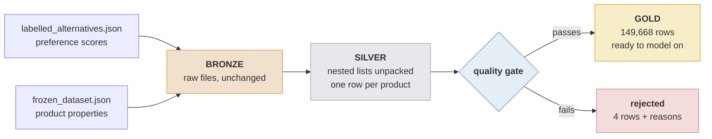

# concrete-lakehouse-pipeline

Two messy JSON files turned into one clean, validated table, using PySpark and
Delta Lake on Databricks.

The data is a published research dataset of concrete product recommendations
([DOI 10.34810/DATA3164](https://doi.org/10.34810/DATA3164)): 42,874 decision
scenarios, each with a handful of candidate concrete mixes. It arrives as two
separate files that have to be matched up to be useful — one holds the
preference scores, the other holds the product properties. Neither is much use
alone.

## What it does



**Bronze** copies the raw files into Delta tables and changes nothing, so
there's always an untouched original to go back to.

**Silver** unpacks the nesting. In the raw files a scenario contains a list of
2–5 products; silver flattens that to one row per product, and splits the
scenario-level fields (stakeholder, situation) into their own tables.

**Gold** joins the two sides on `(scenario, product)`. This is the table you'd
actually use.

Splitting it this way means a bug in the unpacking is fixed by rebuilding silver
and gold — no need to touch the 140 MB of raw input again.

## It only processes what changed

A run does not rebuild the tables. It works out what is actually new, and
touches only that:

1. **Hash every raw file** and compare against `bronze_ingest_log`. Nothing new
   means the run writes nothing at all.
2. **Append** unseen files to bronze, tagged with their content hash. Bronze is
   append-only, so every version of every file it has ever seen is still there.
3. **Upsert silver** for the scenarios those files contain — insert, update, and
   **delete rows a scenario has lost**.
4. **Read silver's Change Data Feed** to find which scenarios actually moved,
   and recompute gold for exactly those.

Three details in there are the whole design:

**Identifying files by content, not by name.** Two things can happen: a new file
lands beside the old one, or the same file is replaced with a corrected superset
— which is what a dataset re-release at a DOI looks like. Auto Loader, the
obvious tool here, handles the first and **structurally cannot handle the
second**: it tracks work by file path and deliberately ignores modifications, so
a rewritten `frozen_dataset.json` is silently skipped. A SHA-256 per file catches
both with one rule, costs about a second on 140 MB, and makes a re-run a no-op
instead of a double load.

**Deleting, not just upserting.** If a re-release drops a scenario from 6 labels
to 3, a merge that only inserts and updates leaves 3 stale rows behind forever,
and no row count anywhere reveals it — the table just keeps answering with data
the source no longer contains. So the merge has a third clause, `WHEN NOT
MATCHED BY SOURCE THEN DELETE`, scoped to the scenarios in the batch.

**Asking the table what changed, not the code.** Gold could be told which
scenarios were ingested. It reads silver's change feed instead, so a manual
correction to silver, or a previous run that died between silver and gold, still
produces the right gold rows.

That last point has a consequence worth stating: `(scenario_id, id_prod)` is
**not** a unique key — scenarios `2647` and `13122` label `prod_1` twice — and a
`MERGE` on a non-unique key fails outright. So every silver row carries an
ordinal from `posexplode`, which is what gives it a stable identity.

## The tables

| Table | One row per | Rows |
|---|---|---|
| `bronze_ingest_log` | file version consumed, by content hash | 2 |
| `bronze_labels` / `bronze_features` | scenario, still nested | 42,874 each |
| `silver_labels` | scenario + label ordinal | 149,672 |
| `silver_features` | scenario + alternative ordinal | 149,670 |
| `silver_scenario_stakeholder` | scenario + stakeholder ordinal | 45,146 |
| `silver_scenario_situation` | scenario + situation ordinal | 43,755 |
| **`gold_scenarios`** | **label + its product's features** | **149,668** |
| `gold_scenarios_rejected` | rejected row, with reasons | 4 |

## The quality gate

Before anything reaches gold it gets checked. A row that fails is written to
`gold_scenarios_rejected` with the reason attached, rather than dropped
silently. Promoted + rejected always adds up to the joined total.

| Check | Failures on the real data |
|---|---|
| `pref` and `conf` between 0 and 1 | 0 |
| No duplicate `(scenario, product)` | **4** |
| Both files agree on which products a scenario has | 0 |
| Every label has matching properties, and vice versa | 0 |
| `compressive_strength` 5–150 MPa | 0 |
| `water_to_cement_ratio` 0.20–1.00 | 0 |
| `density` 1200–3000 kg/m³ | 0 |

Those 4 failures are a real error in the source data: scenarios `2647` and
`13122` each label product `prod_1` **twice**, with contradictory scores (0.62
at confidence 0.75 against 0.05 at confidence 0.95). Both copies are rejected —
the source gives no basis for picking a winner. The other products in those
scenarios promote normally.

**Recording a problem isn't the same as noticing one.** A scheduled job whose
input has structurally broken would otherwise go green every night while writing
a progressively emptier gold table. So the run *fails* when:

- rejections exceed **1%** of rows (the real data is at 0.003%, a ~300x margin)
- any row lands with `source_type = unknown`, meaning the scenario ids no longer
  match any pattern the classifier knows and it needs updating

`gold_scenarios` also carries Delta `CHECK` constraints — `pref` and `conf` in
[0,1], a known `source_type`, both sides of the join present. The gate already
guarantees these; the constraints make it the *table's* guarantee, so a future
writer that bypasses this pipeline can't quietly violate it.

## Where the data came from (`source_type`)

The scenario IDs mix three different kinds of data in one file. Every gold row
is tagged so you can filter or compare them:

| ID looks like | `source_type` | Scenarios |
|---|---|---|
| `control_health_1068` | `control_synthetic` — synthetic probes, 8 axes | 24,000 |
| `3782` | `llm_generated` | 18,602 |
| `expert_118` | `expert_annotated` | 272 |

Two traps found by profiling the files (`scripts/explore_raw.py`), both of which
would corrupt the tagging silently:

- `expert_1..272` and the plain IDs `1..272` both count from 1 but are **completely
  different scenarios** — none of the 272 pairs share the same products.
- `control_archfinish` and `control_archfinish_slump` are two separate probes,
  not one with a suffix.

## Does the output make sense?

A direction check, not a model. If the join paired the wrong label with the
wrong product, preference wouldn't track anything — and row counts would never
reveal it, because a mis-keyed join gives you exactly the right number of
exactly wrong rows.

Each `control_*` family varies one variable and holds the rest steady, so each
should light up on its own variable and sit near zero elsewhere:

```
control_axis              rows          gwp       health    circ_orig
gwp                     10,459      -0.9994      +0.0067      +0.0165
health                  10,504      -0.6695      +0.9152      +0.6293
archfinish              10,512      -0.0043      -0.0017      -0.6038
archfinish_slump        10,665      +0.0163      -0.0145      +0.0055
cost                    10,312      +0.0067      -0.0047      -0.0153
density                 10,440      +0.0165      +0.0009      -0.0148
fwu                     10,501      -0.0207      +0.0099      +0.0077
wdp                     10,447      +0.0058      +0.0033      +0.0075
```

That diagonal is the result. `archfinish` is negative on `circ_orig` (−0.60) on
purpose: in that family more recycled content means a worse surface finish.

## Delta time travel

`gold_scenarios` is written with a deliberately buggy `source_type` rule, then
overwritten with the correct one. Delta keeps both versions, so the fix can be
diffed:

```
11,553 rows reclassified, 0 added, 0 removed

before               -> after                      rows   scenarios
llm_generated        -> control_synthetic        10,665       3,000
llm_generated        -> expert_annotated            888         272
```

3,000 and 272 — precisely the `archfinish_slump` family and the expert family.
And the old version is still queryable:

```sql
SELECT * FROM workspace.concrete.gold_scenarios VERSION AS OF 0
```

That's the thing you can't do with CSVs.

---

## Running it on Databricks

Run on **Databricks Free Edition**, serverless compute (Databricks Runtime
19.6.x, Photon). The row counts and correlations in this README were produced
there and reproduced byte-for-byte on a local Spark run. One-time setup:

1. **Catalog** → in the `workspace` catalog, create a schema `concrete`, and
   inside it a **volume** named `raw`.
2. Upload `labelled_alternatives.json` and `frozen_dataset.json` to that volume.
3. **Workspace → Repos** → clone this repo (already done if you're reading it there).
4. Run `notebooks/01_build_and_validate.py`, then `notebooks/02_delta_time_travel.py`.

Both notebooks run on serverless. The first cell prints where it's reading from
and writing to, so a wrong path fails immediately instead of halfway through.

The tables land in Unity Catalog, so they show up in Catalog Explorer and can be
queried with plain SQL.

The notebooks contain no logic — they set two paths and call into
`src/concrete_pipeline/`. The only difference from a laptop run is one config
line:

```python
config = PipelineConfig(
    raw_dir=Path("/Volumes/workspace/concrete/raw"),
    namespace="workspace.concrete",          # -> Unity Catalog tables
)
```

Without `namespace`, the same code writes Delta tables to a local folder.

## Deploying it as a scheduled job

`databricks.yml` defines the pipeline as a **Databricks Asset Bundle** — a
scheduled Job, deployed from the command line:

```bash
databricks bundle validate -t dev
databricks bundle deploy   -t dev
databricks bundle run concrete_pipeline -t dev   # trigger it now
```

Three tasks on serverless compute, chained. Ran green on Free Edition in ~100s
end to end, producing the same row counts and correlations as the notebook and
the local run:

| Task | Runs | Fails the job when |
|---|---|---|
| `build_tables` | `run_pipeline.py --namespace workspace.concrete` | ingestion breaks, or rejections exceed the gate's limits |
| `validate_gold` | `validate_gold.py --namespace workspace.concrete` | a correlation points the wrong way |
| `maintain_tables` | `maintain_tables.py --retain-hours 168` | compaction fails |

Maintenance is last, and off the ingest path, for two reasons: compacting a bad
batch into the table it broke is worse than leaving it fragmented, and `VACUUM`
permanently destroys the time travel the versioning demo depends on. A week of
history is retained.

The job runs **the same entry points a laptop runs**, with `--namespace`
redirecting the output to Unity Catalog. There is no Databricks-specific copy of
the logic anywhere.

`bundle deploy` builds `src/` into a wheel and installs it into the serverless
environment, so `import concrete_pipeline` resolves in the job the same way it
does in a venv. That is not decoration: Databricks executes a `python_file` via
`exec()`, where `__file__` does not exist, so the usual
`sys.path.insert(Path(__file__)...)` trick fails outright. Shipping a package is
the fix.

Targets: `dev` deploys under your user folder, prefixes the job name with
`[dev <you>]` and forces the schedule **paused**, so a dev deploy can never
start firing on its own. `prod` deploys to `/Workspace/Shared` and unpauses the
daily 06:00 schedule. Catalog, schema and volume path are bundle variables, so
prod could point at a different catalog without touching code.

A note on the schedule: this dataset is static, so a daily cron is really just
demonstrating the shape. A real incremental source would use a file-arrival
trigger with Auto Loader, and bronze would `MERGE` rather than `overwrite`.

## Running it locally

Needs Python 3.10–3.13 (PySpark doesn't support 3.14 yet) and a JDK 17.

```bash
python -m venv .venv
source .venv/bin/activate          # Windows: .venv\Scripts\activate
pip install -r requirements.txt
```

The raw files are **not** in this repo — they're CC BY-NC 4.0 and ~140 MB. Get
them from [the DOI](https://doi.org/10.34810/DATA3164) and put them in
`data/raw/`. Or skip them: every script takes `--fixtures` and runs against a
5-scenario synthetic stand-in in `tests/fixtures/`.

```bash
python scripts/explore_raw.py            # profile the raw files
python scripts/run_pipeline.py           # ingest whatever is new
python scripts/run_pipeline.py --full-refresh   # reprocess every scenario
python scripts/validate_gold.py          # the direction check
python scripts/maintain_tables.py        # OPTIMIZE + VACUUM
python scripts/delta_versioning_demo.py  # the time-travel diff

pytest -m "not spark"                    # pure logic, ~1s
pytest                                   # everything, several minutes
```

Running `run_pipeline.py` twice does nothing the second time — that's the point.
Use `--full-refresh` after changing the classifier or a transformation, since
the source files haven't changed but their derived rows have.

Most of the test time is Spark: each assertion is a real job, and `MERGE` is
several. The `not spark` subset — the classifier, the direction logic, the
config, and the serverless-portability guards — is 34 of the 113 tests and runs in under 2s. The marker is applied
automatically based on which fixtures a test requests, so nothing has to be
labelled by hand.

For a real run, give the driver some room first — both files are one big JSON
array, so Spark has to read each in a single task:

```bash
export PYSPARK_SUBMIT_ARGS="--driver-memory 6g pyspark-shell"
```

Windows also needs `winutils.exe` and `hadoop.dll` — see
[docs/windows-setup.md](docs/windows-setup.md).

## Layout

```
src/concrete_pipeline/
    ingest.py       content hashing, the ingestion log, what to read
    bronze.py       append-only landing + Delta read/write/time-travel helpers
    upsert.py       scenario-scoped MERGE, including the delete clause
    silver.py       posexplode into flat tables, then upsert
    changes.py      Change Data Feed -> which scenarios actually moved
    gold.py         join, gate, upsert, CHECK constraints
    quality.py      rejection reasons and the failing thresholds
    validation.py   correlation direction checks
    maintenance.py  OPTIMIZE / VACUUM
    pipeline.py     orchestration and the run report
    config.py       paths, namespaces, thresholds, limits
    schemas.py      explicit schemas for both raw files
    session.py      Spark session (local, notebook, or job)
    source_type.py  the provenance classifier, and its defective ancestor

scripts/                  command-line entry points — also what the Job runs
notebooks/                the Databricks exploratory view
databricks.yml            the bundle: pipeline as a scheduled Job
tests/                    pytest suite + synthetic fixtures
docs/windows-setup.md     local Windows Spark setup
```

`src/` holds plain functions over DataFrames and imports nothing from
Databricks. Everything else is a thin caller: the scripts parse arguments, the
notebooks set two paths, the bundle schedules the scripts. That is what lets the
same code run on a laptop and on serverless and produce identical output.

Tests run against the fixtures only, so they need neither the raw files nor
Databricks. 113 of them, including a four-stage integration test that drives a
first load, a no-op re-run, a new batch arriving, and a file being replaced —
asserting at each stage that only the affected scenarios moved. CI runs the lot
on Python 3.11 and 3.12 on every push.

`tests/test_portability.py` is worth a mention: it parses the AST of everything
under `src/`, `scripts/` and `notebooks/` and fails if it finds `cache()`,
`persist()` or `.rdd`. Databricks serverless runs on Spark Connect and rejects
all three, but `cache()` is lazy — so the failure appears minutes into a job
run, in a stack trace that names a thread pool rather than the line at fault.
Both of those cost a full deploy-and-run cycle to diagnose before the guard
existed.

## Citation

Dataset: CORA.RDR, [https://doi.org/10.34810/DATA3164](https://doi.org/10.34810/DATA3164),
CC BY-NC 4.0 — cite using the string on the DOI landing page.

Paper: *Context-adaptive deep learning for sustainable product recommendation:
Application to concrete*, Sustainable Production and Consumption, 2026.

This repo is an engineering re-implementation of the dataset's preparation, not
a redistribution of the data.
